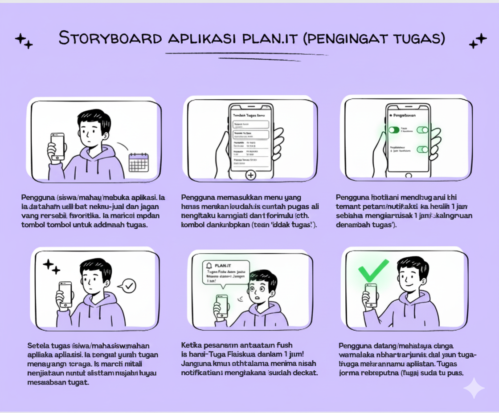
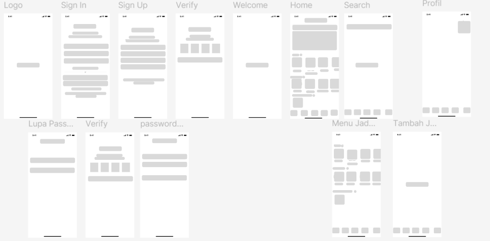
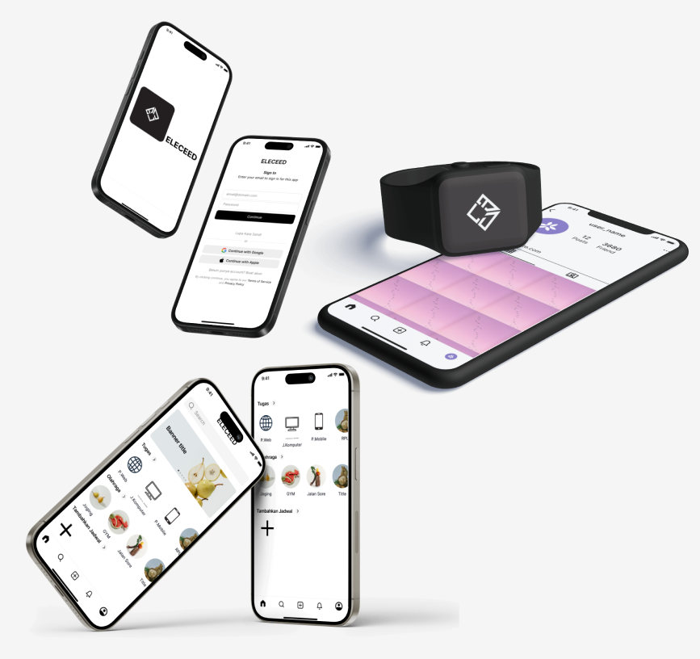
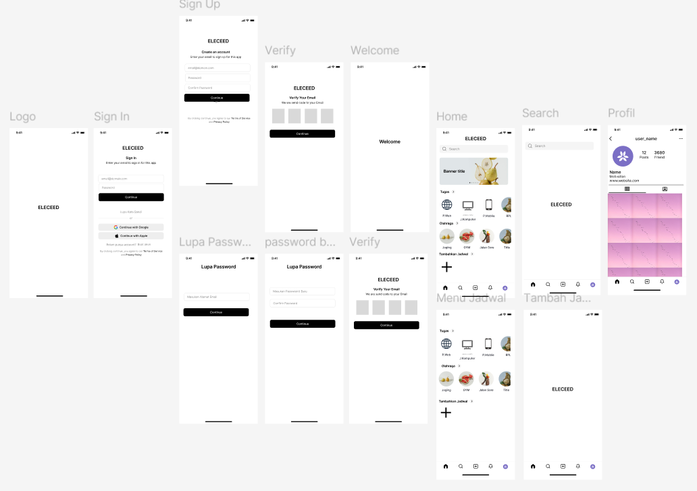
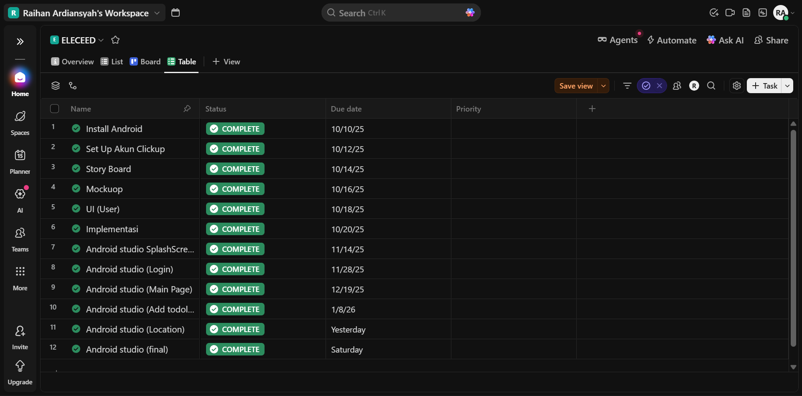

# UAS_PEMOGRAMAN_MOBILE-1

# Nama:Raihan Ardiansyah

# Nim: 312410396

# Kelas: TI.24.A.3

# Mata Kuliah: Pemograman Mobile 1

# Projeck Android: Aplikasi ToDoList

**Berikut alur dari pembuatan aplikasinya**

1. Membuat story board

Aplikasi Plan.it ini menggambarkan alur penggunaan aplikasi pengingat tugas yang dirancang khusus untuk pelajar atau mahasiswa. Prosesnya dimulai ketika pengguna membuka aplikasi dan melihat antarmuka yang bersih untuk melihat daftar tugas yang sudah ada atau menambahkan tugas baru. Pengguna kemudian memasukkan detail tugas seperti nama tugas dan tenggat waktu (deadline) ke dalam formulir yang tersedia agar sistem dapat mencatatnya dengan akurat.

2. WireFrame

Rancangan wireframe untuk aplikasi ELECEED ini menampilkan kerangka struktur aplikasi yang komprehensif, mulai dari alur masuk (login) hingga manajemen konten utama. Struktur ini diawali dengan layar Logo dan sistem autentikasi yang mencakup halaman Sign In, Sign Up, serta Verify untuk keamanan akun pengguna. Terdapat pula alur pemulihan akun melalui layar Lupa Password dan pengaturan kata sandi baru. Pada bagian inti aplikasi, antarmuka dirancang dengan tata letak yang bersih, mencakup halaman Home untuk ringkasan aktivitas, fitur Search, dan Menu Jadwal untuk pengorganisasian tugas. Selain itu, wireframe ini menunjukkan integrasi profil pengguna yang mendetail serta tombol navigasi bawah (bottom navigation bar) yang konsisten di setiap layar untuk memudahkan perpindahan antar menu utama.

3. Mockup

Secara visual, mockup ini menunjukkan implementasi desain pada perangkat smartphone dan smartwatch, mengisyaratkan bahwa aplikasi ELECEED mendukung ekosistem multi-perangkat untuk kemudahan akses. Halaman utama menggunakan skema warna monokromatik hitam-putih yang elegan dengan aksen gambar produk yang cerah pada bagian banner dan ikon kategori

4. UI dan UX

Rancangan UI aplikasi ELECEED mengusung konsep desain yang bersih dan fungsional dengan dominasi palet warna monokromatik (hitam dan putih) yang memberikan kesan modern serta profesional. Pada bagian autentikasi, antarmuka dirancang sederhana agar pengguna tetap fokus pada pengisian data, sementara halaman utama (Home) menggunakan tata letak berbasis kartu (card-based layout) dengan ikon visual yang memudahkan navigasi antar kategori aktivitas. Implementasi desain ini juga terlihat sangat fleksibel, karena tidak hanya dioptimalkan untuk perangkat smartphone, tetapi juga diadaptasi untuk antarmuka smartwatch yang menjaga konsistensi elemen visual. Selain itu, integrasi fitur sosial pada bagian profil—yang menampilkan jumlah pengikut dan koleksi foto dalam bentuk grid—menambah nilai interaktivitas, menjadikannya bukan sekadar aplikasi manajemen tugas biasa, melainkan juga platform untuk berbagi pencapaian

Dan ini untuk link UXnya: https://youtube.com/shorts/ZyBPVn8KxA0?feature=share

5. ClickUp

Clickup ini di gunakan untuk memperbarui/mengupdate hal yang saya lakukan dalam pengerjaan aplikasi ini.
ini Link ClickUpnya: https://app.clickup.com/90181811659/v/s/90187449207

**Dan ini hasil akhir dari aplikasi yang saya buat**

**Link Youtube**

* SplashScreen Aplikasi: https://youtube.com/shorts/DKQnPmakOmU?feature=share
* Aplikasi Berjalan: https://youtube.com/shorts/Y_1byff8k5Y?feature=share

Mungkin Sekian Terimakasih
